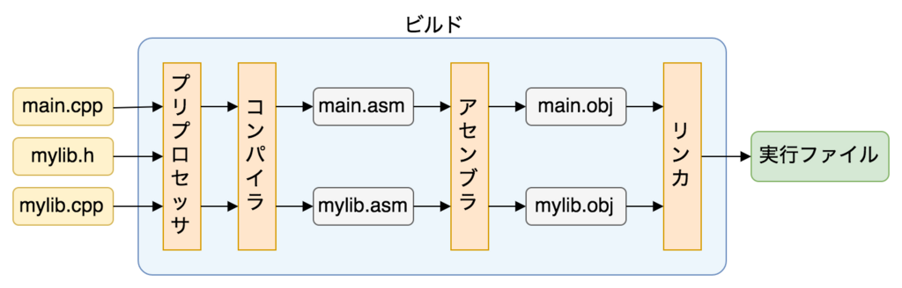

## C/C++ のビルドの仕組み


### プリプロセッサ
コンパイラのための下準備を行う

ソースファイル（`*.c`/`*.cpp`）１つ１つに対して、
- `#include`や`#define`などのプリプロセッサディレクティブ（プリプロセッサ命令）の解決
- コメントの削除

を行うプログラム

#### `#include` の解決
ソースファイルの中で`#include`が指定されていた場合、
1. 指定されたヘッダファイルを探してくる
2. ソースファイルの`#include`があった場所に、指定されたヘッダファイルの中身をまるごと貼り付ける

- 再帰的に行われる処理（つまり、インクルードしたヘッダファイルに`#include`の指定があれば、そのファイルの中身もソースファイルにコピーされる）


#### プリプロセッサディレクティブの種類
- ファイルの読み込み
- 定数、マクロの定義
- 条件付きコンパイル

##### ファイルの読み込み
- `#include`
    - Cコンパイラに用意されている標準関数のファイルを読み込む場合：`#include <ファイル名>`
    - 自作関数のファイルを読み込む場合：`#include "ファイル名"`

##### 定数、マクロの定義

- `#define`
    - 定数に名前をつける場合：`#define 定数名 定数`
    - マクロを定義する場合：`#define マクロ名(引数) 処理`
    - マクロの定義で処理が複数行になる場合：
        ```
        #define マクロ名(引数) 処理1 \
                            処理2
        ```


- `#undef`：`#define`で定義した定数やマクロを無効化する
    - `#undef 定数名/マクロ名`
    - `#undef` した定数名/マクロ名に異なる値/処理を再定義できる

##### 条件付きコンパイル

以下のプリプロセッサディレクティブを使用することで、コンパイルする対象を制御できる


- `#if ~ #elif ~ #else ~ #endif`
    ```
    #if 条件1
    ソースコード1;

    #elif 条件2
    ソースコード2;

    #else
    ソースコード3;

    #endif
    ```


- `#ifdef (もしくは#ifndef)  ~ #elif #else ~ #endif`
    ```
    #ifdef (#ifndef) 定数1 または マクロ1
    ソースコード1;

    #elif 定数2 または マクロ2
    ソースコード2;

    #else
    ソースコード3;

    #endif
    ```

#### 引用
- [疑似命令とプロセッサ命令の違い](https://teratail.com/questions/173815)　`#include` は疑似命令じゃねえじゃねえか苦Cこの野郎
- [プリプロセッサ](http://www.itsenka.com/contents/development/c/preprocessor.html)
- [プリプロセッサ（上の物より詳細、未来の私いつか読んでください）](https://segakuin.com/c/preprocessor.html)

### コンパイラ
コンパイル
: プリプロセッサを通過した（C/C++で書かれた）ソースファイルをアセンブリ言語のファイルに変換する処理

コンパイラ
: プリプロセッサから受け取ったソースファイル（`*.c`/`*.cpp`）１つ１つをコンパイルするプログラム

#### コンパイラの内部処理
1. 字句解析：ソースコードの文字列をトークンに分割
2. 構文解析：文法チェック
3. 意味解析：実行可能かどうかをチェック（文法はあっていても実行できない場合もある）
4. コード最適化：より速く実行できるようにプログラムの無駄をなくしたりオブジェクトコードのサイズを小さくする
5. コード生成：中間表現のオブジェクトファイルを生成する

[後で見てください](https://www.gadgety.net/shin/tips/unix/compiler.html)


#### ソースコードを跨いで参照される関数のコンパイル方法

**コンパイラはそれぞれのソースファイルを独立にコンパイルする**

どうしてエラーにならないのか？

→ **ヘッダファイル**と**プロトタイプ宣言**

1. ヘッダファイルの内容はプリプロセッサによってソースファイルに丸ごと貼り付けられている
2. ヘッダファイルにはソースファイルで用いる関数のプロトタイプ宣言が書かれている
3. ので、ソースファイルがコンパイルされるとき、コンパイラは別ファイルにその関数が存在するという前提でコンパイルする

→ コンパイラは、ソースコードを跨いで参照される関数の実装を保留した状態（**外部参照が未解決**）のアセンブリ言語のファイルをソースファイル分作成する


### アセンブラ

アセンブラ
: コンパイラで生成されたアセンブリ言語のファイルを機械語のファイルに変換する（アセンブリする）プログラム
    CPUのアーキテクチャに合わせた機械語に変換される


### リンカ

リンク
: 主に以下の２つの処理
  - 複数のオブジェクトファイルを１つにまとめる
  - ラベルへの参照を解決する

[いつか読んでください](https://tanakamura.github.io/pllp/docs/linker.html)

リンカの仕事

- 分割されたオブジェクトファイルを１つに結合する
- 単一ファイルでも内部でライブラリを使用している場合、そのライブラリのリンクが必要


**というかそもそも実行のためにリンクは必要不可欠**
1. システム・コール
    1. プログラムは実行のためにOSのシステム・コールを利用する
    2. システム・コールの呼び出しは普通アセンブリで書かれる
    3. C言語でシステム・コール呼び出しをするには、アセンブリ言語のソースとC言語のソースを別々のオブジェクトファイルにし、リンクする必要がある

2. スタートアップ・ルーチン
実行ファイルの作成には**スタートアップ・ルーチン**をおこなうプログラムをリンクする必要がある

スタートアップルーチン
: レジスタの初期化や`main()`への引数（`argc`,`argv`）の設定、その他各種設定の初期化の処理
- 一番最初に実行され、そこから`main`関数が呼び出される

3. アドレスへの配置
関数や変数の実際のアドレスへの配置を行う


**リンク ＝ 受け取った機械語のファイルを、OSに依存する実行形式に変換する処理**

[リンカとローダの役割](https://shop.cqpub.co.jp/hanbai/books/38/38071/38071.pdf)

リンカ
: リンカを実行するプログラム


なんかリンカの仕事多すぎて何言っとるのかさっぱりわからんちーん

#### リンク方法の違いによるライブラリの種類   
- 静的ライブラリ
- 動的ライブラリ
- 動的ロード（動的ライブラリを使用したリンク）

##### 静的ライブラリ
- 複数のオブジェクトファイルをまとめた１つのファイル（←要出典）
- 拡張子は（linux環境では）`.a`
- リンク時に通常のオブジェクトファイルと同様に使用できる
- つまりリンクの際に実行ファイルに結合され、１つのオブジェクトファイルを生成する
- 静的ライブラリをリンクすることを静的リンクとよぶ

##### 動的ライブラリ
- 実行時に結合されるオブジェクトファイルをまとめた１つのファイル
- 拡張子は（linux環境では）`.so`
- 実行ファイルのビルド時にはライブラリファイルとの依存関係の設定のみを行う
- 実行時に実行ファイルとライブラリを結合し、外部参照を解決する

##### 動的ロード
- プログラム実行中に動的ライブラリを読み込んで使用するリンク処理
- 拡張子は（linux環境では）`.so`

動的ロードの手順
1. 動的ライブラリを開く
2. 関数や変数のポインタを取得
3. 動的ライブラリを閉じる

後で見てください〜〜〜〜

[ゼロから学ぶC++ ビルド](https://rinatz.github.io/cpp-book/ch11-01-build/)


### 参照
- [C/C++ のビルドの仕組みとライブラリ](https://kamino.hatenablog.com/entry/c%2B%2B-principle-of-build-library)
