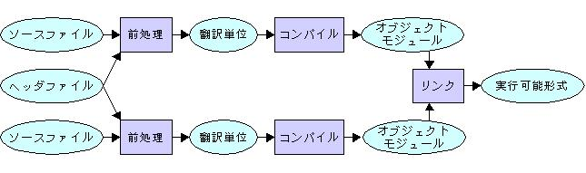
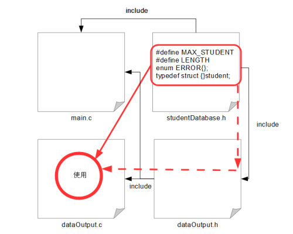
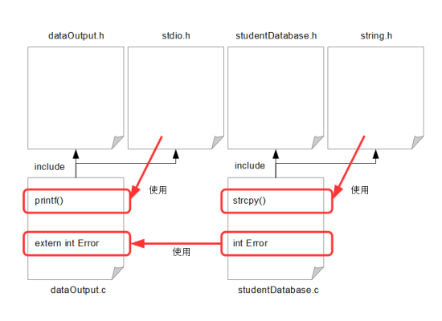

## C言語のファイルの違い

- ソースファイル `.c`：プログラムの実態が書かれたファイル
- ヘッダファイル `.h`：定数の定義や関数のプロトタイプ、データ構造などの宣言が書かれたファイル
- オブジェクトファイル `.o` `.obj`：コンパイラでC言語のソースコードをコンパイルしてできるファイル


モジュール（翻訳単位）
: １つのプログラムを複数に分割し、プリプロセッサにかけた後のそれそれのソースファイル

なんかオブジェクトモジュールをただモジュールって言ってるのもある





[分割コンパイルとリンケージ](http://www.cc.kyoto-su.ac.jp/~hxm/cstext/prog06.html)

## ヘッダファイル

### ヘッダファイルに記述するもの 
→ 外部と共有したいデータ

- ヘッダファイルには外部で利用する
    - 定数
    - マクロ
    - 構造体
    - 関数のプロトタイプ宣言

    を定義する
- 他のヘッダファイルで定義された定数や構造体を同名のソースコード内で利用したい場合は、そのヘッダファイルをインクルードする
- ソースファイルでの関数についての記述は宣言のみにする（バイナリが肥大化するから）


`#include `の際にヘッダーファイルを囲う`<*.h>`と`"*.h"`の違い
- `<*.h>`
    - インクルードの際に主にコンパイラオプションや環境変数で指定されるパスを優先して探す
    - システムから提供される機能を提供するヘッダーファイルを想定
- `"*.h"`
    - インクルードの際に自身と同じパスにあるヘッダーファイルを優先して探す
    - 指定のファイルがない場合は`<*.h>`と同様にコンパイラオプションなどを参照して探す


## ソースファイル


### ソースコードに記述するもの



- 自身と同じ名前のヘッダファイルをインクルードする
- 自身と同じ名前のヘッダファイルは、他のヘッダファイルのインクルードよりも先に記述する<br>
    A.h
    ```
    #pragma once
    Test spawnTest();
    ```
    A.c
    ```
    #include "B.h"  // Testの定義がされているソースファイルのヘッダファイル
    #include "A.h"

    Test spawnTest() {
        /* 実装 */
    }
    ```
    があったとして、この場合はコンパイルできるが、<br>A.hを他のモジュールからインクルードした場合、`Test`の宣言がないのでエラーになる？？？？えそれでいいんじゃないの？？？？

- `stdio.h`のような大きいファイルは、ヘッダファイルでインクルードすると、そのヘッダファイル内の関数などは使うが`stdio.h`内の関数などは使わないソースファイルのヘッダファイルでも不必要にインクルードされてしまうため、ソースコードでインクルードするのが良い
- **`.c`ファイルをインクルードしてはいけない！！**


[ヘッダファイルの書きかた](https://qiita.com/MoriokaReimen/items/7c83ebd0fbae44d8532d)

#### extern宣言とstatic変数

##### extern宣言
グローバル変数の共有に使用

- C言語はファイルごとにコンパイル・アセンブルされるので、関数や変数の参照関係はモジュール（アセンブル後に生成されるオブジェクトファイル）単位で閉じている
- 他のモジュールで定義された関数や変数を参照するには、参照したいソースファイルの中でその関数・変数を`extern`宣言する必要がある

- `extern`宣言すると
    - コンパイル・アセンブル時は内容は保留してとりあえず機械言語に変換
    - リンカが結合時に`extern`宣言された関数・変数を他のモジュールやライブラリから探索し結合する

- `stdio.h`などの処理系に用意されたライブラリ関数のヘッダファイルでは`extern`によるプロトタイプ宣言がされている


- グローバル変数は幸せになれない


[externとモジュール](https://dev.grapecity.co.jp/support/powernews/column/clang/015/page03.htm)

##### static変数


### インクルードガード

インクルードガード
: ヘッダファイルが自身を複数回インクルードされることを防ぐ仕組み

ソースファイルでインクルードされているヘッダファイルを再帰的に取得していると、同じヘッダファイルの内容を複数貼り付けてしまう可能性がある<br>
ので、ヘッダファイルを書くときは、
- 中の実装を`#ifndef XXX_H` で囲む<br>
  ```
    #ifndef MYLIB_H
    #define MYLIB_H

    // ここにコードを書く（#include もこの中にかく）

    #endif
  ```
    - もし`MYLIB_H`というマクロが定義されていなかったら、`MYLIB_H`を定義し、その内容を読み込むという意味
    - １回目にこのヘッダファイルが読み込まれた際にソースファイルに`MYLIB_H`が定義されるので、このヘッダファイルの内容が重複してインクルードされることはない
- 先頭に`pragma once`を記入<br>
    ```
    #pragma once
    // ここに処理をかく
    ```

して１回しかインクルードしないようにコンパイラに指示をする

[ファイル分割の例](./exsample_of_FileSplit.md)

### ファイル分割の原則（例外あり）

ヘッダファイル
|記載順序|情報|内容|
|:---:|:---:|:---:|
|1|ヘッダファイルのインクルード|必要なヘッダファイルをインクルード|
|2|マクロの定義|外部ファイルと共有するマクロを定義|
|3|列挙型の定義|外部ファイルと共有する列挙型を定義|
|4|構造体の定義|外部ファイルと共有する構造体を定義|
|5|関数のプロトタイプ宣言|外部ファイルと共有する関数を定義|


ソースファイル
|記載順序|情報|内容|
|:---:|:---:|:---:|
|1|ヘッダファイルのインクルード|対応するヘッダファイルや必要なヘッダファイルをインクルード|
|2|マクロの定義|外部ファイルには共有しないマクロを定義|
|3|列挙型の定義|外部ファイルには共有しない列挙型を定義|
|4|関数のプロトタイプ宣言|外部ファイルには共有しない関数を定義|
|5|構造体の定義|外部ファイルには共有しない構造体を定義|
|6|グローバル変数（非static）|externで外部ファイルと共有するグローバル変数|
|7|グローバル変数（static）|外部ファイルとは共有しないグローバル変数|
|8|関数の定義|ヘッダファイル/ファイル内で宣言されている関数の定義|


## リンク

- 識別子の有効範囲はソースファイルごとに異なるので、基本的にはファイルを跨いだ識別子は参照できない
- 参照できないならファイルを分けたくない
- でも全て参照できても識別子の衝突とか有効範囲・生存期間の把握とかが難しくなって混乱する
- ので、プログラマは参照するものとしないものを制御したい

→ リンク

リンク
: ソースファイルを跨いで識別子を参照できるようにする処理


test.c
```
int a = 1;
```

main.c
```
#include <stdio.h>
#include <stdlib.h>
int a;
int main(void){
    printf("a = %d\n",a);
    return EXIT_SUCCESS;
}
```
main.c の `a` は test.c の `a` とリンクされ（同じ名前の識別子でしかリンクされない）、同じデータオブジェクトを表す

- test.c の `a` と main.c の `a` はそれぞれファイル有効範囲を持つ
- test.c の `a` は宣言と同時に初期化されている（**外部定義**）
- main.c の `a` は宣言だけで、初期化はされていない（**仮定義**）


- 外部から参照できる識別子はファイル有効範囲を持つ（プロック有効範囲とかは参照できない）

#### 外部定義（定義）
外部から参照できる識別子は宣言と同時に初期化されている必要がある

このような（宣言時に初期化されている識別子の）宣言を **外部定義**（もしくは単に**定義**）と呼ぶ

外部定義された識別子は、データオブジェクトの本体となって記憶領域が確保される

実体となるデータオブジェクトを作るので、同じ名前の定義が２つ以上（同じ名前のデータオブジェクト識別子の宣言が２回以上）あるとエラー

main.c の `int a;` を `int a = 1;` にするとエラー


#### 仮定義
初期化の際に識別子が初期化されていない宣言を**仮定義**と呼ぶ

外部定義のデータオブジェクトを参照する仮の定義

実際に外部定義にデータオブジェクトを参照するかどうかはリンク時に決まる

実体となるデータオブジェクトの本体を確保するわけではないので、複数のファイルで同じ名前の仮定義があっても問題ない

結合時に変数（識別子？）`a` の仮定義に対する外部定義が見つからなかった場合、`int a;` は仮定義ではなく各型による初期値（`int`の場合は`0`）で初期化されて宣言された変数`a`の定義として見なされ、データオブジェクトの本体が用意される。

test.c の `a` と main.c の `a` がどちらも仮定義 `int a;`の時、それぞれのファイルの変数`a`は別のファイル有効範囲を持つデータオブジェクトとなる


↑ これ結局お互いに初期化されてファイル有効範囲になるんだから外部定義になるんでは？？？？で、同じ名前なのでエラーになるのでは？？？？？リンクの際の話だから外部定義とかの話じゃなくなるんかな？？？？？


### 内部結合と外部結合

ファイル有効範囲を持つデータオブジェクトにおいて、
結合された識別子を持つデータオブジェクトは同じ識別子のデータオブジェクトを参照するようになる。

内部結合
: データオブジェクトファイルの中で行われる結合
    - 宣言時に`static`をつける<br>
    （例：test.c の `a`の定義を `static int a = 1;`とする）
    - このデータオブジェクト`a`は外部から参照できなくなり、main.c の `a` は外部参照がないものとして扱われる
    - ので、データオブジェクトが別のファイルから参照されないようになる


外部結合
: データオブジェクトファイルを超えて行われるリンク
- 別のファイルからから参照できるリンク

