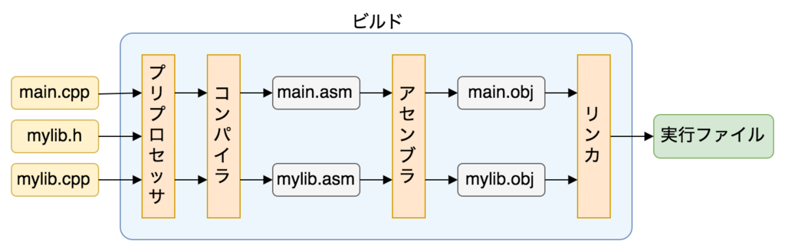
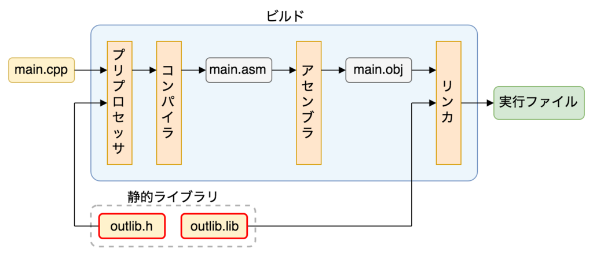

## C/C++ のビルドの仕組みとライブラリ
### ビルドの仕組み


#### プリプロセッサ
コンパイラのための下準備を行う<br>
ソースファイル（`*.c`/`*.cpp`）１つ１つに対して、
- `#include`や`#define`などのプリプロセッサディレクティブ（プリプロセッサ命令）の解決
- コメントの削除

を行うプログラム

##### `#include` の解決
ソースファイルの中で`#include`が指定されていた場合、
1. 指定されたヘッダファイルを探してくる
2. ソースファイルの`#include`があった場所に、指定されたヘッダファイルの中身をまるごと貼り付ける

- 再帰的に行われる処理（つまり、インクルードしたヘッダファイルに`#include`の指定があれば、そのファイルの中身もソースファイルにコピーされる）


##### プリプロセッサディレクティブの種類
- ファイルの読み込み
- 定数、マクロの定義
- 条件付きコンパイル


ファイルの読み込み

`#include`
- `#include <ファイル名>`：Cコンパイラに用意されている標準関数のファイルを読み込む場合
- `#include "ファイル名"`：自作関数のファイルを読み込む場合

定数、マクロの定義

`#define`
- `#define 定数名 定数`：定数に名前をつける場合
- `#define マクロ名(引数) 処理`：マクロを定義する場合
- ```
    #define マクロ名(引数) 処理1 \
                         処理2
  ```：マクロの定義で処理が複数行になる場合

`#undef`：`#define`で定義した定数やマクロを無効化する
- `#undef 定数名/マクロ名`
- `#undef` した定数名/マクロ名に異なる値/処理を再定義できる

条件付きコンパイル
後でちゃんと見ます〜〜〜


##### 引用
- [疑似命令とプロセッサ命令の違い](https://teratail.com/questions/173815)<br>
`#include` 疑似命令じゃねえじゃねえか苦Cこの野郎
- [プリプロセッサ](http://www.itsenka.com/contents/development/c/preprocessor.html)


#### コンパイラ
コンパイル
: プリプロセッサを通過した（C/C++で書かれた）ソースファイルをアセンブリ言語のファイルに変換する処理

コンパイラ
: プリプロセッサから受け取ったソースファイル（`*.c`/`*.cpp`）１つ１つをコンパイルするプログラム


##### ソースコードを跨いで参照される関数のコンパイル方法

**コンパイラはそれぞれのソースファイルを独立にコンパイルする**

どうしてエラーにならないのか？

**ヘッダファイル**と**プロトタイプ宣言**

ヘッダファイルの内容はプリプロセッサによってソースファイルに丸ごと貼り付けられている

ヘッダファイルにはソースファイルで用いる関数のプロトタイプ宣言が書かれている


ので、ソースファイルがコンパイルされるとき

コンパイラは関数の存在の情報のみでコンパイルし？？？

ソースコードを跨いで参照される関数の実際の内容は保留される


#### アセンブラ

アセンブラ
: コンパイラで生成されたアセンブリ言語のファイルを機械語のファイルに変換するプログラム


- 生成されたアセンブリのファイルをオブジェクトファイル（バイナリファイル）と呼び、拡張子は`.obj`
- 1つの`.obj`ファイルをモジュールという


#### リンカ

リンク
: 複数のオブジェクトファイルを１つにまとめる処理

リンカ
: リンカを実行するプログラム


- `main`関数のあるオブジェクトファイルから芋づる式に、コンパイル時に保留していた関数の実装（未解決の外部参照）を探索
- 必要な情報を集めて１つの実行ファイルorライブラリファイルを生成

### ライブラリの種類と仕組み

ライブラリ
: プログラムをいくつかの単位に分割する仕組み<br>
    - ビルドの管理が楽になる
    - コードの再利用が楽になる


ライブラリの形式
- ソースコードを配布
- 静的リンク
- 動的リンク

#### ソースコードを配布
- 自分の書いたソースコードをそのまま配布
- 利用者が再編集できるが、自分でコンパイルする必要がある


#### 静的リンク （static linking）


- コンパイル後のリンク処理の際に


#### 動的リンク （dynamic linking）


#### 動的読み込み（dynamic loading）


[C/C++ のビルドの仕組みとライブラリ](https://kamino.hatenablog.com/entry/c%2B%2B-principle-of-build-library)
