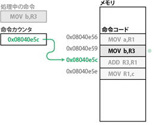

[メモリ](https://www.ipa.go.jp/security/awareness/vendor/programmingv2/clanguage.html)

## メモリ空間

- 大抵のプログラムから見えるのは仮想メモリ
- プロセス（プログラムの実行単位）ごとに異なるメモリ空間が用意されている
- プロセス間でメモリ空間は共有されない

ひとつのメモリ空間は次の用途の領域に分けて使用される
- 命令コードが置かれる領域
- 静的データのための領域
- スタック
- ヒープ

１つのメモリ空間について、領域は別れているが、お互いに干渉することができる

### 命令カウンタ

機械語プログラムは、メモリの命令コード領域から命令が呼び出されて実施されることで進行される

命令の実行は通常はメモリに並べられた順序通りに進行するが、条件分岐や関数呼び出しのような連続しないアドレスに置かれた命令へジャンプする場合もある

命令の実行順序は**命令カウンタ**と呼ばれるレジスタに制御される

命令カウンタ
: 次に実行すべき命令のアドレス
  プロセッサがメモリから命令を呼び出すと、命令カウンタにはその次の命令のアドレスが自動で入れられる

#### 演算命令と命令カウンタ

1. ひとつ前の命令の実行直後

命令カウンタはすでにADD命令のアドレスを指している

2. ADD命令の取り出し

命令カウンタが次の命令のアドレスを指すようになる

3. ADD命令の実行

レジスタ間で加算演算が行われる

4. 次の命令の取り出し

命令カウンタが指していたアドレスから命令が取り出される

#### ジャンプ命令と命令カウンタ

条件分岐命令や関数呼び出し命令が
命令カウンタを別の値に書き換えるため、

？？？？？？なんかこれとほかの記事で言ってることがかみあわないぞ？？？？？

## スタック
- それまでの
- メモリの中で特定の領域を占め、スタックポインタというレジスタを通じてアクセスされる
- スタックポインタは、スタックに置かれたデータの先頭のアドレスを保持している
- スタック領域では、アドレスの値の大きいものから小さいものに向かってデータが保存される

### PUSH と POP

## ヒープ